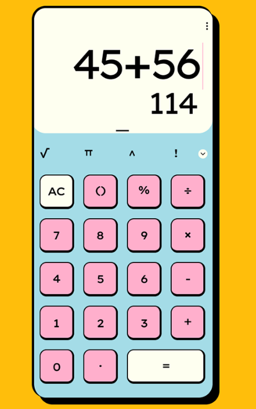

# Neo Brutalist Calculator

A simple calculator application built with React, TypeScript, and Vite that embraces the neobrutalist design aesthetic. This project features a calculator with basic arithmetic operations and a minimalist interface with bold shadows and distinct styling.



## Features

- Basic arithmetic operations (+, -, *, /)
- Support for decimal numbers
- Pi (π) constant support
- Clear entry (C) and all-clear (AC) functions
- Neobrutalist design with bold shadows and contrasting colors

## Live Demo

Check out the live application: [https://neo-brutalist-calculator.vercel.app/](https://neo-brutalist-calculator.vercel.app/)

## Technologies Used

- React
- TypeScript
- Vite
- Tailwind CSS

## Development

This project was created using Vite. To run it locally:

```bash
# Install dependencies
npm install

# Start development server
npm run dev
```

## GitHub Repository

[https://github.com/jeff283/neo-calc](https://github.com/jeff283/neo-calc)
